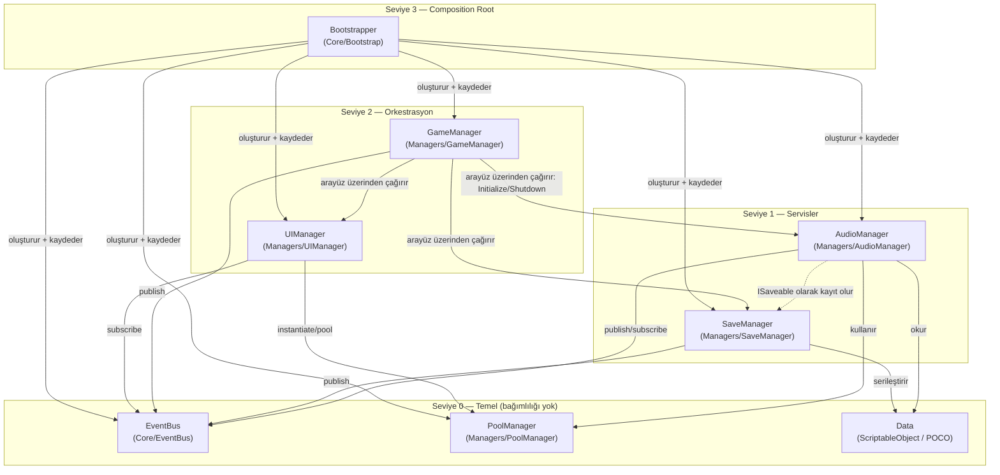

# Game_Mobil — Mimari Tasarım

> Bu doküman bir **mimari plandır**; herhangi bir implementasyon (sınıf gövdesi, metot mantığı) içermez. Amaç, Manager yapılarının, Event Bus'ın, Save/Audio/Pool/Game/UI Manager'ların klasör yerleşimini ve birbirine olan bağımlılıklarını netleştirmektir. Kod yazımına bu plan onaylandıktan sonra başlanmalıdır.

## 1. Temel Prensipler

1. **Composition Root (`Bootstrapper`)** — Tüm manager'ların oluşturulup birbirine bağlandığı **tek** nokta. Uygulamadaki başka hiçbir sınıf concrete manager sınıflarını `new`lememeli veya sahnede elle referans vermemelidir.
2. **Service Locator (`GameServices`)** — Dağınık `Manager.Instance` tekilleri yerine tek, öngörülebilir bir erişim noktası: `GameServices.Get<IAudioManager>()`. Test edilebilirlik ve arayüz üzerinden bağımlılık (DIP) sağlar.
3. **Event Bus önceliği** — Gameplay/UI kodu bir manager'ı asla doğrudan çağırmaz ("ses çal", "kaydet", "paneli göster"). Bunun yerine bir event yayınlar (`EventBus.Publish(...)`), ilgili manager bunu dinler. Bu, `Scripts/Player`, `Scripts/Enemy`, `Scripts/UI` gibi katmanların `Scripts/Managers` içindeki somut sınıflardan tamamen habersiz kalmasını sağlar.
4. **Arayüz üzerinden sözleşme (DIP)** — Her manager'ın `I<Manager>` arayüzü vardır. `GameManager` ve diğer tüketiciler somut sınıflara değil arayüzlere bağımlıdır.
5. **Tek Sorumluluk (SRP)** — `GameManager` sadece akışı yönetir; ses, kayıt veya UI'ın *nasıl* çalıştığını bilmez.
6. **Mobil önceliği** — Tüm tasarım kararları GC baskısını azaltmayı, `Application.persistentDataPath` kullanmayı ve Android yaşam döngüsünü (`OnApplicationPause`) merkeze almayı hedefler.

## 2. Bağımlılık Grafiği



**Önemli kural:** Ok yönü her zaman "yukarıdan aşağıya" veya "servisten Event Bus'a" gider — asla döngüsel değildir. `AudioManager`, `SaveManager`'ı tanımaz; `ISaveable` arayüzü ile kendini kaydettirir (Dependency Inversion). `UIManager`, `GameManager`'ı tanımaz; sadece `GameManager`'ın yayınladığı event'leri dinler. Bu sayede UI, gerçek bir `GameManager` olmadan da (sahte event'lerle) geliştirilip test edilebilir.

## 3. Başlatma Sırası (Bootstrapper)

`Bootstrapper`, ilk yüklenen sahnede (`Main.unity` veya ayrı bir `Boot.unity`) çalışır, `DontDestroyOnLoad` ile kalıcı hale gelir ve aşağıdaki sırayla başlatır:

1. `EventBus` — hiçbir bağımlılığı yok, ilk kurulmalı.
2. `PoolManager` — bağımlılığı yok.
3. `SaveManager` — sadece `Data` katmanına bağımlı.
4. `AudioManager` — `PoolManager` + `Data` + `EventBus` hazır olmalı; kurulduktan sonra `SaveManager.Register(this as ISaveable)` ile kendini kaydeder.
5. `UIManager` — `EventBus` + `PoolManager` hazır olmalı.
6. `GameManager` — hepsi hazır olduktan sonra en son kurulur, state machine'i `Boot` durumundan başlatır.

Bu sıra bozulursa (ör. `AudioManager`, `PoolManager`'dan önce kurulursa) çalışma zamanı hatası yerine `Bootstrapper` içinde açık, sıralı bir kurulum listesi olduğu için hata derleme/kod okuma anında fark edilir.

## 4. Klasör Yapısı (oluşturuldu, dosyalar boş)

```
Assets/Scripts/
├── Core/
│   ├── Bootstrap/          # Bootstrapper, GameServices (service locator)
│   ├── EventBus/           # IGameEvent, EventBus altyapısı
│   │   └── Events/         # GameStateChangedEvent, ScoreChangedEvent, PlaySfxRequestEvent, SaveCompletedEvent...
│   ├── Interfaces/         # IManager, IInitializable, ISaveable, IPoolable
│   └── StateMachine/       # Generic FSM (GameManager tarafından kullanılır)
├── Managers/
│   ├── GameManager/        # IGameManager + GameManager (state machine sahibi)
│   ├── AudioManager/       # IAudioManager + AudioManager
│   ├── UIManager/          # IUIManager + UIManager (ekran/panel stack'i)
│   ├── PoolManager/        # IPoolManager + generic Pool<T>
│   └── SaveManager/        # ISaveManager + SaveManager
├── Systems/                # Manager'ları event/arayüz üzerinden tüketen gameplay sistemleri (mevcut)
├── UI/
│   ├── Views/              # Prefabs/UI altındaki her prefab'a karşılık gelen ekran/panel controller'ları
│   └── Bindings/           # Tekrar kullanılabilir UI bağlama bileşenleri (health bar, score text)
├── Data/
│   ├── Audio/              # AudioLibrary ScriptableObject, AudioEventId tanımı
│   ├── Save/               # SaveData POCO modelleri, SaveSlot tanımı
│   └── Settings/           # GameSettings ScriptableObject (zorluk, dil vb.)
├── Player/, Enemy/, Utilities/   # (mevcut, değişmedi)
```

Tüm bu klasörler bu oturumda **boş** olarak (`.gitkeep` ile) oluşturuldu; içlerine hiçbir `.cs` dosyası eklenmedi.

## 5. Sistem Bazlı Tasarım Notları

### 5.1 Event Bus (`Core/EventBus`)
- Bağımlılığı yok; en temel katman.
- Tip-güvenli, generic yapı önerilir: `EventBus.Subscribe<T>(Action<T>)`, `EventBus.Publish<T>(T evt)`, `T : IGameEvent`.
- Event'ler `Core/EventBus/Events` altında domain'e göre gruplanır (ör. `GameStateChangedEvent`, `ScoreChangedEvent`, `PlaySfxRequestEvent`, `SaveCompletedEvent`).
- **Mobil not:** Event struct'ları `class` değil `readonly struct` olarak tanımlanmalı — sık tetiklenen event'lerde (ör. her hasar alışta) heap allocation / GC spike'ını önler.

### 5.2 Save System (`Managers/SaveManager` + `Data/Save`)
- `ISaveable` sözleşmesi: `string SaveId`, `object CaptureState()`, `void RestoreState(object state)`.
- `SaveManager` somut `AudioManager`/`GameManager` tiplerini bilmez; sadece kayıtlı `ISaveable` listesini gezer — yeni bir sistem save'e dahil olmak istediğinde `SaveManager`'ı değiştirmeye gerek kalmaz (Open/Closed).
- Dosya konumu **mutlaka** `Application.persistentDataPath` olmalı (Android'de `StreamingAssets`/`Resources` build sonrası salt-okunurdur).
- **Mobil kritik nokta:** Kayıt sadece `OnApplicationQuit`'te değil, `OnApplicationPause(true)`'da da tetiklenmeli — Android işletim sistemi arka plandaki uygulamayı bildirimsiz sonlandırabilir.

### 5.3 Audio Manager (`Managers/AudioManager` + `Data/Audio`)
- Ses çalma isteği doğrudan metot çağrısıyla değil, `PlaySfxRequestEvent`/`PlayMusicRequestEvent` ile Event Bus üzerinden yapılır.
- `AudioLibrary` (ScriptableObject, `Data/Audio`) bir `AudioEventId → AudioClip` eşlemesi tutar; tasarımcılar kod değiştirmeden yeni ses ekleyebilir.
- `AudioSource` bileşenleri `PoolManager` üzerinden alınır/bırakılır — her ses için `Instantiate`/`Destroy` yapılmaz.
- `ISaveable` uygular (ses seviyeleri kalıcı olsun diye), `SaveManager`'a kendini kaydettirir.

### 5.4 Pool Manager (`Managers/PoolManager`)
- Generic `Pool<T> where T : Component, IPoolable` (`IPoolable.OnSpawn()/OnDespawn()`).
- Bağımlılığı yoktur; `AudioManager`, düşman spawner'ları, mermi/VFX sistemleri buradan yararlanır.
- **Mobil kritik nokta:** Sık `Instantiate`/`Destroy` mobilde en büyük GC/CPU maliyetlerinden biridir; havuzlama zorunlu kabul edilmeli.

### 5.5 Game Manager (`Managers/GameManager` + `Core/StateMachine`)
- Generic bir FSM (`Core/StateMachine`) kullanır: `Boot → MainMenu → Loading → Gameplay → Paused → GameOver`.
- Yeni bir durum eklemek `GameManager`'ın merkezi switch/if bloğunu değiştirmeyi gerektirmemeli (Open/Closed) — her durum kendi `IGameState` sınıfı olmalı.
- Diğer manager'lara sadece `Initialize()`/`Shutdown()` gibi yaşam döngüsü çağrıları için arayüz üzerinden erişir; iç mantıklarına karışmaz.

### 5.6 UI Manager (`Managers/UIManager` + `UI/Views`, `UI/Bindings`)
- Stack tabanlı ekran yönetimi (`Push`/`Pop`) — Pause menüsü, Gameplay HUD'unu yok etmeden üstüne binebilir.
- Her ekran `Prefabs/UI` altındaki bir prefab'a karşılık gelen `UI/Views` içinde bir view sınıfıdır.
- Sadece Event Bus'ı dinler (`GameStateChangedEvent`, `ScoreChangedEvent`, `HealthChangedEvent`); `GameManager`'ı doğrudan sorgulamaz, `Update()` içinde polling yapmaz.
- Sık açılıp kapanan panelller `PoolManager` üzerinden, nadir kullanılanlar basit `SetActive` ile yönetilebilir (mobil bellek/performans dengesi).

## 6. Neden MonoBehaviour Singleton Değil?

Klasik `public static Instance` deseni yerine ServiceLocator + arayüz önerilmesinin nedenleri:

- **Test edilebilirlik:** Arayüz üzerinden sahte (`Null`/`Mock`) implementasyon enjekte edilebilir.
- **Gizli bağımlılık riski yok:** `GameManager.Instance.Audio.Instance.Play(...)` gibi zincirleme çağrılar yerine açık, kayıt zamanında belli olan bağımlılıklar.
- **Sahne kirliliği azalır:** Her manager için ayrı `DontDestroyOnLoad` nesnesi yerine tek `Bootstrapper` kökü.
- **Büyüme yolu:** Proje büyüdükçe `GameServices` katmanı, gerekirse VContainer/Zenject gibi tam bir DI çözümüne minimum sürtünmeyle geçiş yapılabilecek şekilde tasarlanmıştır.

## 7. Sıradaki Adım

Bu mimari onaylandıktan sonra önerilen implementasyon sırası:
1. `Core/Interfaces` + `Core/EventBus` (bağımlılığı olmayan temel).
2. `Managers/PoolManager`.
3. `Managers/SaveManager` + `Data/Save`.
4. `Managers/AudioManager` + `Data/Audio`.
5. `Core/StateMachine` + `Managers/GameManager`.
6. `Managers/UIManager` + `UI/Views` + `UI/Bindings`.
7. `Core/Bootstrap` (en son — çünkü hepsine bağımlı).

Bu sırada henüz hiçbir implementasyon yapılmadı; yukarıdaki liste sadece plandır.
